-   <a href="#descriptive-statistics"
    id="toc-descriptive-statistics">Descriptive Statistics</a>
    -   <a href="#sex" id="toc-sex">Sex</a>
    -   <a href="#age" id="toc-age">Age</a>
    -   <a href="#ssq-total" id="toc-ssq-total">SSQ Total</a>
    -   <a href="#ssq-nausea" id="toc-ssq-nausea">SSQ Nausea</a>
    -   <a href="#ssq-occulomotor" id="toc-ssq-occulomotor">SSQ Occulomotor</a>
    -   <a href="#ssq-disorinetation" id="toc-ssq-disorinetation">SSQ
        Disorinetation</a>
-   <a href="#differences-across-test-variables"
    id="toc-differences-across-test-variables">Differences across Test
    Variables</a>
    -   <a href="#statistical-methods" id="toc-statistical-methods">Statistical
        Methods</a>
    -   <a href="#results-summary" id="toc-results-summary">Results Summary</a>
    -   <a href="#distance-from-end" id="toc-distance-from-end">Distance from
        End</a>
        -   <a href="#standard-triangle-test"
            id="toc-standard-triangle-test">Standard Triangle Test</a>
            -   <a href="#statistical-model" id="toc-statistical-model">Statistical
                Model</a>
            -   <a href="#model-summary" id="toc-model-summary">Model Summary</a>
        -   <a href="#vr-triangle-test" id="toc-vr-triangle-test">VR Triangle
            Test</a>
            -   <a href="#statistical-model-1" id="toc-statistical-model-1">Statistical
                Model</a>
            -   <a href="#model-summary-1" id="toc-model-summary-1">Model Summary</a>
    -   <a href="#angle-of-deviation" id="toc-angle-of-deviation">Angle of
        Deviation</a>
        -   <a href="#standard-triangle-test-1"
            id="toc-standard-triangle-test-1">Standard Triangle Test</a>
            -   <a href="#statistical-model-2" id="toc-statistical-model-2">Statistical
                Model</a>
            -   <a href="#model-summary-2" id="toc-model-summary-2">Model Summary</a>
        -   <a href="#vr-triangle-test-1" id="toc-vr-triangle-test-1">VR Triangle
            Test</a>
            -   <a href="#statistical-model-3" id="toc-statistical-model-3">Statistical
                Model</a>
            -   <a href="#model-summary-3" id="toc-model-summary-3">Model Summary</a>
    -   <a href="#distance-travelled" id="toc-distance-travelled">Distance
        Travelled</a>
        -   <a href="#standard-triangle-test-2"
            id="toc-standard-triangle-test-2">Standard Triangle Test</a>
            -   <a href="#statistical-model-4" id="toc-statistical-model-4">Statistical
                Model</a>
            -   <a href="#model-summary-4" id="toc-model-summary-4">Model Summary</a>
        -   <a href="#vr-triangle-test-2" id="toc-vr-triangle-test-2">VR Triangle
            Test</a>
            -   <a href="#statistical-model-5" id="toc-statistical-model-5">Statistical
                Model</a>
            -   <a href="#model-summary-5" id="toc-model-summary-5">Model Summary</a>
-   <a href="#test-retest-reliability"
    id="toc-test-retest-reliability">Test-retest Reliability</a>
    -   <a href="#statistical-methods-1"
        id="toc-statistical-methods-1">Statistical Methods</a>
    -   <a href="#results-summary-1" id="toc-results-summary-1">Results
        Summary</a>
    -   <a href="#distance-from-end-1" id="toc-distance-from-end-1">Distance
        from End</a>
        -   <a href="#standard-triangle-test-3"
            id="toc-standard-triangle-test-3">Standard Triangle Test</a>
        -   <a href="#vr-triangle-test-3" id="toc-vr-triangle-test-3">VR Triangle
            Test</a>
    -   <a href="#angle-of-deviation-1" id="toc-angle-of-deviation-1">Angle of
        Deviation</a>
        -   <a href="#standard-triangle-test-4"
            id="toc-standard-triangle-test-4">Standard Triangle Test</a>
        -   <a href="#vr-triangle-test-4" id="toc-vr-triangle-test-4">VR Triangle
            Test</a>
    -   <a href="#distance-travelled-1" id="toc-distance-travelled-1">Distance
        Travelled</a>
        -   <a href="#standard-triangle-test-5"
            id="toc-standard-triangle-test-5">Standard Triangle Test</a>
        -   <a href="#standard-triangle-test-first-4"
            id="toc-standard-triangle-test-first-4">Standard Triangle Test (First
            4)</a>
        -   <a href="#vr-triangle-test-5" id="toc-vr-triangle-test-5">VR Triangle
            Test</a>
        -   <a href="#vr-triangle-test-first-4" id="toc-vr-triangle-test-first-4">VR
            Triangle Test (First 4)</a>
-   <a href="#convergent-validity" id="toc-convergent-validity">Convergent
    Validity</a>
    -   <a href="#statistical-methods-2"
        id="toc-statistical-methods-2">Statistical Methods</a>
    -   <a href="#results-summary-2" id="toc-results-summary-2">Results
        Summary</a>
    -   <a href="#distance-travelled-session-1"
        id="toc-distance-travelled-session-1">Distance Travelled (Session 1)</a>
    -   <a href="#distance-travelled-session-2"
        id="toc-distance-travelled-session-2">Distance Travelled (Session 2)</a>
    -   <a href="#absolute-agreement-for-distance-travelled-session-2"
        id="toc-absolute-agreement-for-distance-travelled-session-2">Absolute
        Agreement for Distance Travelled (Session 2)</a>
-   <a href="#references" id="toc-references">References</a>

# Descriptive Statistics

## Sex

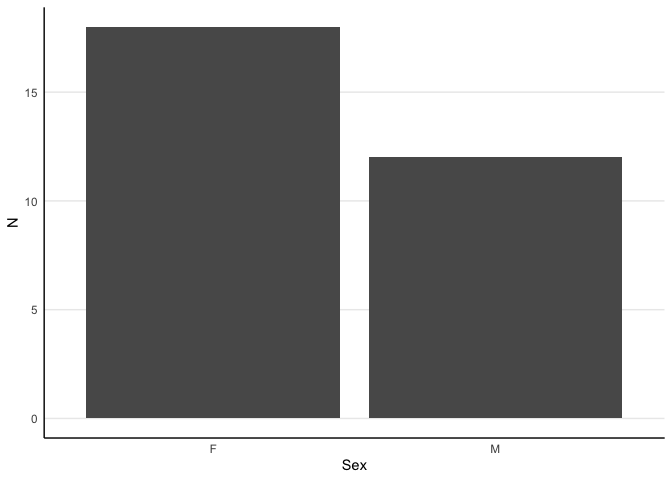<!-- -->

| Sex |   N | Percentage |
|:----|----:|-----------:|
| F   |  18 |         60 |
| M   |  12 |         40 |

## Age

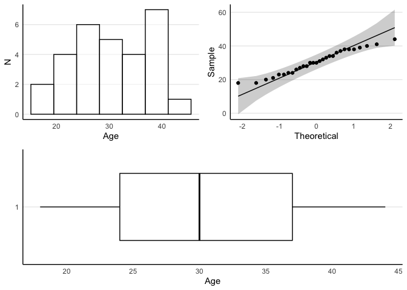<!-- -->

|     Mean | Median | Min | Max |       SD | IQR |
|---------:|-------:|----:|----:|---------:|----:|
| 30.51724 |     30 |  18 |  44 | 7.283154 |  13 |

## SSQ Total

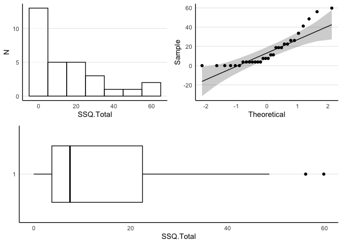<!-- -->

|     Mean | Median | Min |   Max |       SD |  IQR |
|---------:|-------:|----:|------:|---------:|-----:|
| 15.45867 |   7.48 |   0 | 59.84 | 17.31337 | 18.7 |

## SSQ Nausea

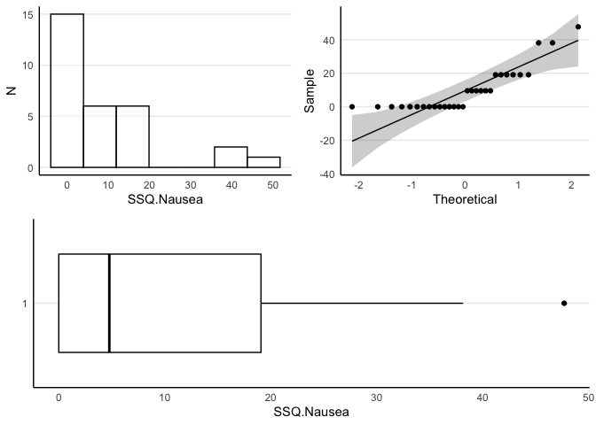<!-- -->

|  Mean | Median | Min |  Max |       SD |   IQR |
|------:|-------:|----:|-----:|---------:|------:|
| 9.858 |   4.77 |   0 | 47.7 | 13.13406 | 19.08 |

## SSQ Occulomotor

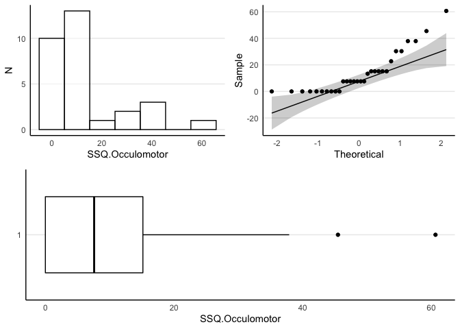<!-- -->

|     Mean | Median | Min |   Max |       SD |   IQR |
|---------:|-------:|----:|------:|---------:|------:|
| 13.58267 |   7.58 |   0 | 60.64 | 15.72199 | 15.16 |

## SSQ Disorinetation

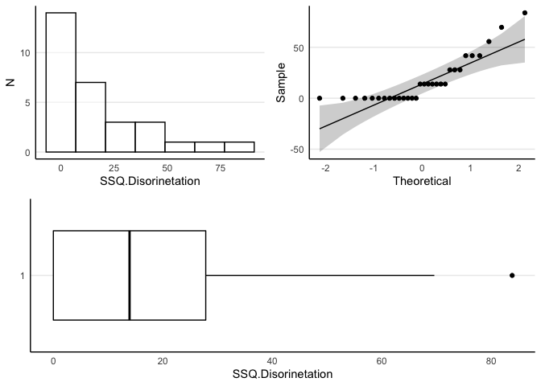<!-- -->

|   Mean | Median | Min |   Max |      SD |   IQR |
|-------:|-------:|----:|------:|--------:|------:|
| 17.178 |  13.92 |   0 | 83.82 | 22.7664 | 27.84 |

# Differences across Test Variables

## Statistical Methods

To evaluate differences across sessions, clockwise/anti-clockwise
direction and 1m/2m length, linear mixed effects models are fitted to
the data from the standard triangle test and VR triangle test separately
(Bates, Mächler, Bolker, & Walker, 2015; R Core Team, 2021). Three
outcomes are evaluated: distance from the end, absolute angle of
deviation and total distance traveled. These models evaluate the mean
differences across these variables while accounting for the repeated
measures with random intercepts fitted for individual participants.
Normality and homogeneity of variance assumptions are evaluated with
QQ-plots and fitted values vs residuals plots. If the model assumptions
are violated, data is fitted with generalized linear mixed models with
Gamma distribution and identity or log link. Means and mean differences
are reported along with their standard errors. Statistical significance
threshold is set at 0.05.

## Results Summary

For standard triangle test, the mean distance from end is 49.2 ± SE 3.4
for session 1. There is statistically significant (z = -2.2, p = 0.03)
decrease (-5.8 ± SE 2.7) in session 2. There are no statistical
differences (p \> 0.05) across clockwise/anti-clockwise direction or
1m/2m length.
For VR triangle test, the mean distance from end is 46 ± SE 3.5 for
session 1. There is statistically significant (z = -2.4, p = 0.016)
decrease (-6.8 ± SE 2.8) in session 2. There are no statistical
differences (p \> 0.05) across clockwise/anti-clockwise direction or
1m/2m length.
For standard triangle test, the mean angle of deviation is 9.1 ± SE 1.1
for session 1. There are no statistical differences (p \> 0.05) across
sessions, clockwise/anti-clockwise direction or 1m/2m length.
For VR triangle test, the mean angle of deviation is 9.5 ± SE 1.1 for
session 1. There is statistically significant (z = -2.6, p = 0.01)
decrease (20% ± SE 1%) in session 2. There are no statistical
differences (p \> 0.05) across clockwise/anti-clockwise direction or
1m/2m length.
For standard triangle test, the mean distance traveled is 198.7 ± SE 3.8
for session 1. There is statistically significant (z = 7.4, p \< 0.0001)
increase (15.9 ± SE 2.2) in session 2. There are no statistical
differences (p \> 0.05) across clockwise/anti-clockwise direction or
1m/2m length.
For VR triangle test, the mean distance traveled is 220.5 ± SE 6.6 for
session 1. There are no statistical differences (p \> 0.05) across
sessions, clockwise/anti-clockwise direction or 1m/2m length.

## Distance from End

### Standard Triangle Test

#### Statistical Model

#### Model Summary

    Generalized linear mixed model fit by maximum likelihood (Laplace
      Approximation) [glmerMod]
     Family: Gamma  ( identity )
    Formula: Dist.from.End ~ Time.Period + Is.Clockwise + Is.1m.First + (1 |  
        PartID)
       Data: dataSource.s
    Control: glmerControl(optimizer = c("bobyqa"))

         AIC      BIC   logLik deviance df.resid 
      3297.3   3320.6  -1642.6   3285.3      354 

    Scaled residuals: 
        Min      1Q  Median      3Q     Max 
    -1.8225 -0.7078 -0.1428  0.6295  3.6654 

    Random effects:
     Groups   Name        Variance Std.Dev.
     PartID   (Intercept) 54.5919  7.3886  
     Residual              0.2779  0.5272  
    Number of obs: 360, groups:  PartID, 30

    Fixed effects:
                  Estimate Std. Error t value Pr(>|z|)    
    (Intercept)     49.168      3.387  14.515   <2e-16 ***
    Time.Period2    -5.773      2.678  -2.156   0.0311 *  
    Is.Clockwise1   -4.419      2.617  -1.689   0.0913 .  
    Is.1m.First2     4.132      2.727   1.515   0.1297    
    ---
    Signif. codes:  0 '***' 0.001 '**' 0.01 '*' 0.05 '.' 0.1 ' ' 1

    Correlation of Fixed Effects:
                (Intr) Tm.Pr2 Is.Cl1
    Time.Perid2 -0.392              
    Is.Clockws1 -0.413  0.007       
    Is.1m.Frst2 -0.317 -0.122 -0.054

### VR Triangle Test

#### Statistical Model

#### Model Summary

    Generalized linear mixed model fit by maximum likelihood (Laplace
      Approximation) [glmerMod]
     Family: Gamma  ( identity )
    Formula: Dist.from.End ~ Time.Period + Is.Clockwise + Is.1m.First + (1 |  
        PartID)
       Data: dataSource.vr
    Control: glmerControl(optimizer = c("bobyqa"))

         AIC      BIC   logLik deviance df.resid 
      3314.8   3338.1  -1651.4   3302.8      354 

    Scaled residuals: 
        Min      1Q  Median      3Q     Max 
    -1.6972 -0.6976 -0.1728  0.5004  4.3270 

    Random effects:
     Groups   Name        Variance Std.Dev.
     PartID   (Intercept) 53.5506  7.3178  
     Residual              0.3216  0.5671  
    Number of obs: 360, groups:  PartID, 30

    Fixed effects:
                  Estimate Std. Error t value Pr(>|z|)    
    (Intercept)     46.005      3.502  13.135   <2e-16 ***
    Time.Period2    -6.816      2.840  -2.400   0.0164 *  
    Is.Clockwise1    1.249      2.787   0.448   0.6541    
    Is.1m.First2     3.419      2.883   1.186   0.2357    
    ---
    Signif. codes:  0 '***' 0.001 '**' 0.01 '*' 0.05 '.' 0.1 ' ' 1

    Correlation of Fixed Effects:
                (Intr) Tm.Pr2 Is.Cl1
    Time.Perid2 -0.486              
    Is.Clockws1 -0.357 -0.080       
    Is.1m.Frst2 -0.429  0.107  0.012

## Angle of Deviation

### Standard Triangle Test

#### Statistical Model

#### Model Summary

    Generalized linear mixed model fit by maximum likelihood (Laplace
      Approximation) [glmerMod]
     Family: Gamma  ( log )
    Formula: Angle.of.Deviation ~ Time.Period + Is.Clockwise + Is.1m.First +  
        (1 | PartID)
       Data: dataSource.s
    Control: glmerControl(optimizer = c("bobyqa"))

         AIC      BIC   logLik deviance df.resid 
      2340.7   2363.9  -1164.3   2328.7      348 

    Scaled residuals: 
        Min      1Q  Median      3Q     Max 
    -1.3109 -0.6891 -0.1594  0.4889  4.8146 

    Random effects:
     Groups   Name        Variance Std.Dev.
     PartID   (Intercept) 0.1065   0.3263  
     Residual             0.5738   0.7575  
    Number of obs: 354, groups:  PartID, 30

    Fixed effects:
                  Estimate Std. Error t value Pr(>|z|)    
    (Intercept)    2.21069    0.11304  19.557   <2e-16 ***
    Time.Period2   0.05160    0.08761   0.589    0.556    
    Is.Clockwise1 -0.07385    0.08620  -0.857    0.392    
    Is.1m.First2   0.13793    0.08747   1.577    0.115    
    ---
    Signif. codes:  0 '***' 0.001 '**' 0.01 '*' 0.05 '.' 0.1 ' ' 1

    Correlation of Fixed Effects:
                (Intr) Tm.Pr2 Is.Cl1
    Time.Perid2 -0.348              
    Is.Clockws1 -0.363 -0.032       
    Is.1m.Frst2 -0.343 -0.088 -0.010

### VR Triangle Test

#### Statistical Model

#### Model Summary

    Generalized linear mixed model fit by maximum likelihood (Laplace
      Approximation) [glmerMod]
     Family: Gamma  ( log )
    Formula: Angle.of.Deviation ~ Time.Period + Is.Clockwise + Is.1m.First +  
        (1 | PartID)
       Data: dataSource.vr
    Control: glmerControl(optimizer = c("bobyqa"))

         AIC      BIC   logLik deviance df.resid 
      2300.7   2324.1  -1144.4   2288.7      354 

    Scaled residuals: 
        Min      1Q  Median      3Q     Max 
    -1.2984 -0.7362 -0.1767  0.4944  4.5578 

    Random effects:
     Groups   Name        Variance Std.Dev.
     PartID   (Intercept) 0.03844  0.1961  
     Residual             0.58027  0.7618  
    Number of obs: 360, groups:  PartID, 30

    Fixed effects:
                  Estimate Std. Error t value Pr(>|z|)    
    (Intercept)    2.24581    0.10030  22.391   <2e-16 ***
    Time.Period2  -0.22638    0.08830  -2.564   0.0104 *  
    Is.Clockwise1  0.04019    0.08813   0.456   0.6483    
    Is.1m.First2   0.03902    0.08827   0.442   0.6584    
    ---
    Signif. codes:  0 '***' 0.001 '**' 0.01 '*' 0.05 '.' 0.1 ' ' 1

    Correlation of Fixed Effects:
                (Intr) Tm.Pr2 Is.Cl1
    Time.Perid2 -0.451              
    Is.Clockws1 -0.444 -0.008       
    Is.1m.Frst2 -0.478  0.041  0.030

## Distance Travelled

### Standard Triangle Test

#### Statistical Model

#### Model Summary

    Generalized linear mixed model fit by maximum likelihood (Laplace
      Approximation) [glmerMod]
     Family: Gamma  ( identity )
    Formula: Dist.Travelled ~ Time.Period + Is.Clockwise + Is.1m.First + (1 |  
        PartID)
       Data: dataSource.s
    Control: glmerControl(optimizer = c("bobyqa"))

         AIC      BIC   logLik deviance df.resid 
      3178.5   3201.7  -1583.3   3166.5      348 

    Scaled residuals: 
        Min      1Q  Median      3Q     Max 
    -7.7488 -0.5204  0.1037  0.6142  3.0567 

    Random effects:
     Groups   Name        Variance  Std.Dev.
     PartID   (Intercept) 67.792330 8.23361 
     Residual              0.008735 0.09346 
    Number of obs: 354, groups:  PartID, 30

    Fixed effects:
                  Estimate Std. Error t value Pr(>|z|)    
    (Intercept)    198.724      3.810  52.163  < 2e-16 ***
    Time.Period2    15.937      2.157   7.388 1.49e-13 ***
    Is.Clockwise1    1.237      2.140   0.578    0.563    
    Is.1m.First2    -2.928      2.147  -1.364    0.173    
    ---
    Signif. codes:  0 '***' 0.001 '**' 0.01 '*' 0.05 '.' 0.1 ' ' 1

    Correlation of Fixed Effects:
                (Intr) Tm.Pr2 Is.Cl1
    Time.Perid2 -0.256              
    Is.Clockws1 -0.278 -0.017       
    Is.1m.Frst2 -0.277 -0.035  0.023

### VR Triangle Test

#### Statistical Model

#### Model Summary

    Generalized linear mixed model fit by maximum likelihood (Laplace
      Approximation) [glmerMod]
     Family: Gamma  ( identity )
    Formula: Dist.Travelled ~ Time.Period + Is.Clockwise + Is.1m.First + (1 |  
        PartID)
       Data: dataSource.vr
    Control: glmerControl(optimizer = c("bobyqa"))

         AIC      BIC   logLik deviance df.resid 
      3782.5   3805.9  -1885.3   3770.5      354 

    Scaled residuals: 
        Min      1Q  Median      3Q     Max 
    -7.1658 -0.4409  0.0707  0.5154  2.5279 

    Random effects:
     Groups   Name        Variance Std.Dev.
     PartID   (Intercept) 96.93413 9.8455  
     Residual              0.01908 0.1381  
    Number of obs: 360, groups:  PartID, 30

    Fixed effects:
                  Estimate Std. Error t value Pr(>|z|)    
    (Intercept)   220.5129     6.5302  33.768   <2e-16 ***
    Time.Period2    0.1955     4.6548   0.042    0.966    
    Is.Clockwise1  -3.7617     4.6509  -0.809    0.419    
    Is.1m.First2    1.9222     4.6505   0.413    0.679    
    ---
    Signif. codes:  0 '***' 0.001 '**' 0.01 '*' 0.05 '.' 0.1 ' ' 1

    Correlation of Fixed Effects:
                (Intr) Tm.Pr2 Is.Cl1
    Time.Perid2 -0.346              
    Is.Clockws1 -0.344 -0.032       
    Is.1m.Frst2 -0.356  0.015 -0.003

# Test-retest Reliability

## Statistical Methods

Between-session test-retest reliability is assessed separately for the
standard triangle test and the VR triangle test. Three outcomes are
evaluated: distance from the end, angle of deviation and total distance
traveled. Reliability is evaluated for mean of 6 tests from each session
with Pearson’s product moment correlation. This coefficient is
interpreted as the consistency of the instrument across two time points.
The magnitude of the coefficient (r) is interpreted as excellent
(\>0.900), good (0.750–0.899), moderate (0.500–0.749) and poor (\<0.500)
(Portney, Watkins, et al., 2009). If the reliability for an outcome is
moderate or better, it is also assessed for the mean of first 4 tests
from the two sessions. Normality of the outcome measures is evaluated
with QQ-plots.

## Results Summary

For standard triangle test, with average across six tests, distance from
the end and angle of deviation show poor test-retest reliability (r \<
0.5). Only the distance traveled metric shows moderate reliability
(r=0.55 95% CI \[0.23, 0.76\]). With the first 4 tests, the reliability
for distance traveled is also moderate (r=0.53 95% CI \[0.2, 0.75\]).

For VR triangle test, with average across six tests, distance from the
end and angle of deviation show poor test-retest reliability (r \< 0.5).
Only the distance traveled metric shows moderate reliability (r=0.66 95%
CI \[0.4, 0.83\]). With the first 4 tests, the reliability for distance
traveled is also moderate (r=0.65 95% CI \[0.38, 0.82\]).

## Distance from End

### Standard Triangle Test

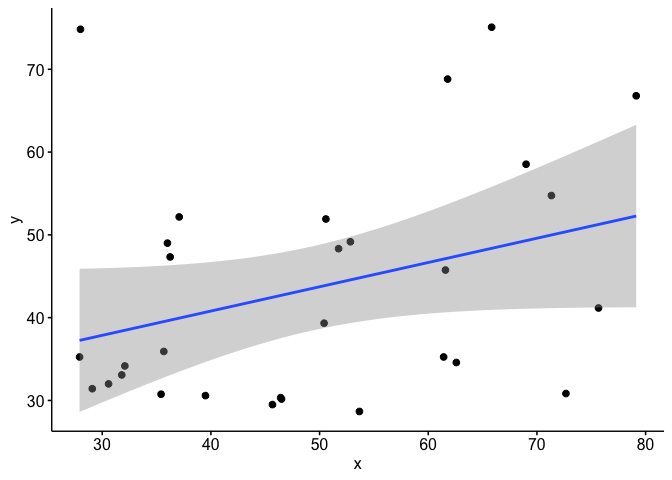<!-- -->

    [1] "r=0.33 95% CI [-0.04, 0.62] t[28]=1.83, p=0.077, Poor"

### VR Triangle Test

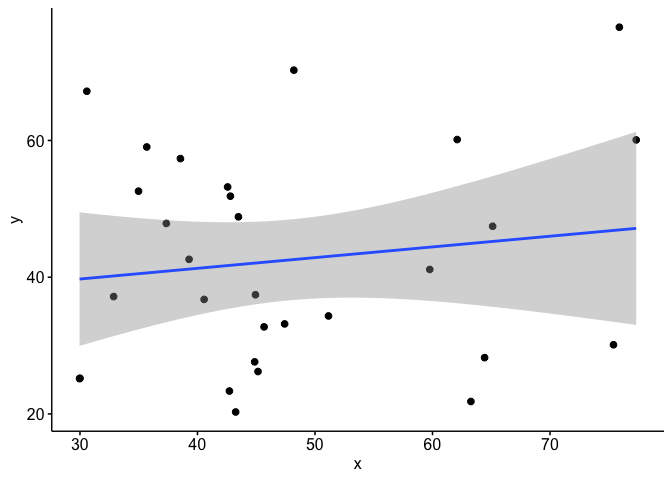<!-- -->

    [1] "r=0.14 95% CI [-0.23, 0.47] t[28]=0.74, p=0.467, Poor"

## Angle of Deviation

### Standard Triangle Test

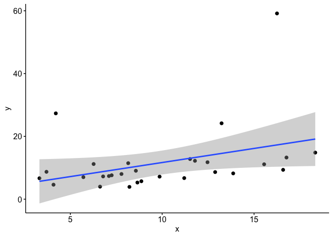<!-- -->

    [1] "r=0.36 95% CI [0, 0.64] t[27]=2.03, p=0.052, Poor"

### VR Triangle Test

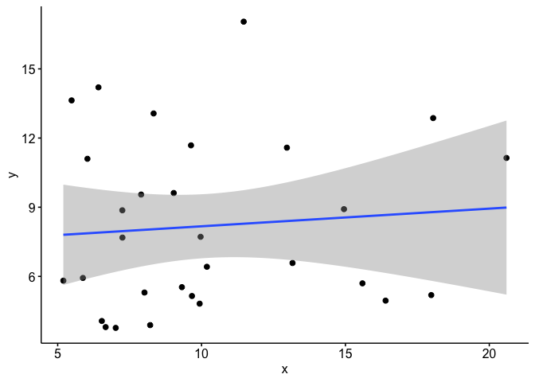<!-- -->

    [1] "r=0.09 95% CI [-0.28, 0.43] t[28]=0.47, p=0.645, Poor"

## Distance Travelled

### Standard Triangle Test

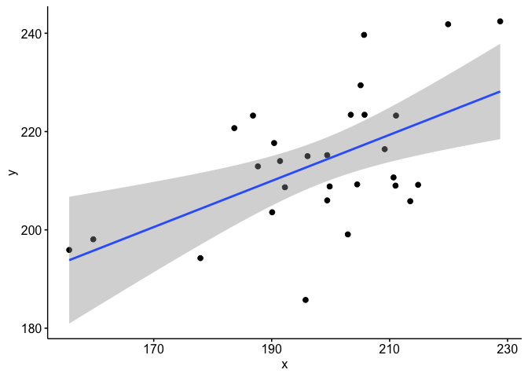<!-- -->

    [1] "r=0.55 95% CI [0.23, 0.76] t[27]=3.4, p=0.002, Moderate"

### Standard Triangle Test (First 4)

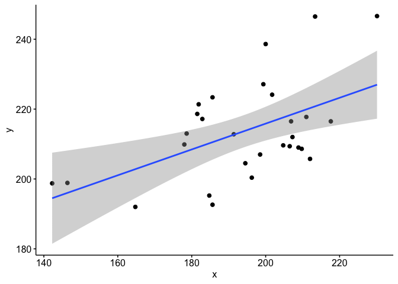<!-- -->

    [1] "r=0.53 95% CI [0.2, 0.75] t[27]=3.21, p=0.003, Moderate"

### VR Triangle Test

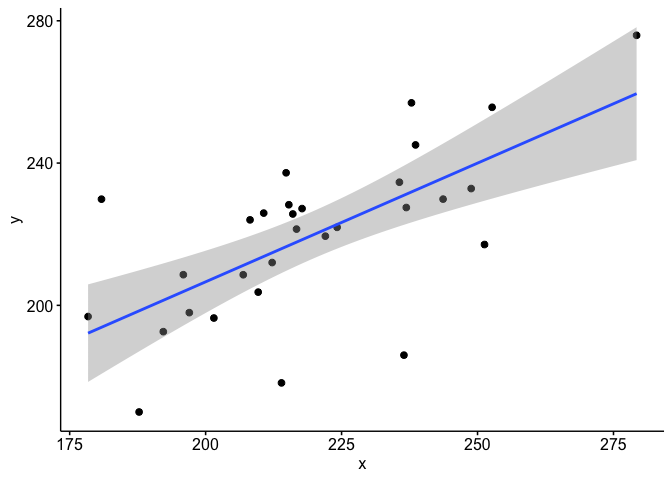<!-- -->

    [1] "r=0.66 95% CI [0.4, 0.83] t[28]=4.69, p=<0.001, Moderate"

### VR Triangle Test (First 4)

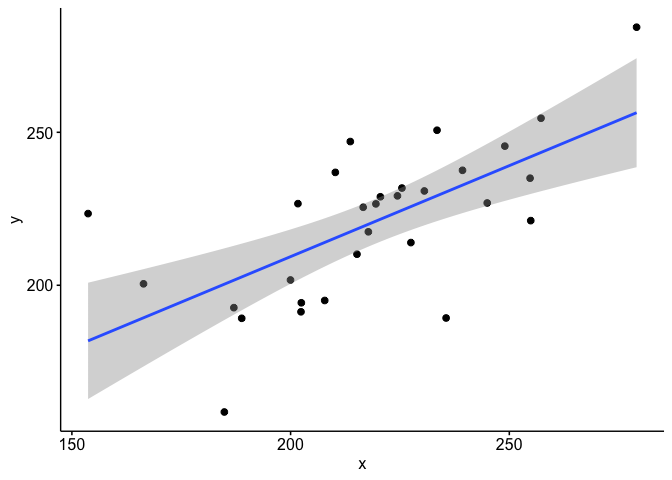<!-- -->

    [1] "r=0.65 95% CI [0.38, 0.82] t[28]=4.52, p=<0.001, Moderate"

# Convergent Validity

## Statistical Methods

Convergent validity is only assessed for the reliable outcomes across
the two instruments. First, the convergence between two instruments is
evaluated using Pearson’s product moment correlation. The magnitude of
the coefficient (r) is interpreted as excellent (\>0.900), good
(0.750–0.899), moderate (0.500–0.749) and poor (\<0.500) (Portney et
al., 2009). If the outcomes have moderate or better convergence, their
absolute agreement is evaluated with a Bland-Altman plot. In addition to
a qualitative assessment of the plot, the bias and limits of agreement
are reported. The bias is interpreted as the systematic error between
the two instruments. The limits of agreement are interpreted as the
range of values which explain 95% of the differences in scores from the
two instruments. The limits of agreement include both the systematic
difference and the random differences across the two instruments. The
percentage limits of agreement are also reported which are obtained by
expressing the limits of agreement as a percentage of the mean of scores
across the instruments. The absolute maximum of the percentage limits of
agreement are interpreted as excellent (0.0–4.9%), good (5.0–9.9%),
moderate (10.0–49.9%) and poor (\>50.0%) absolute agreement.

## Results Summary

For VR triangle test, with average across six tests from session 1,
distance traveled shows show poor convergent validity against distance
traveled on the standard vertical test.

For VR triangle test, with average across six tests from session 2,
distance traveled shows show moderate convergent validity against
distance traveled on the standard vertical test (r=0.64 95% CI \[0.37,
0.81\]).

## Distance Travelled (Session 1)

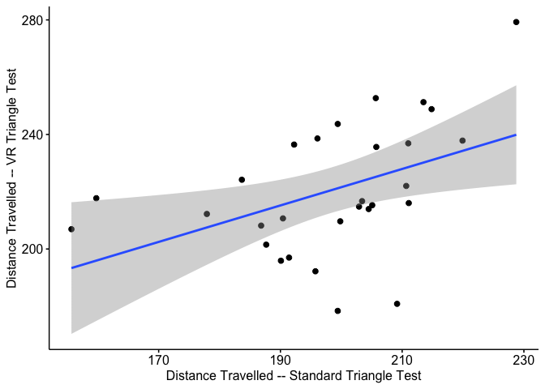<!-- -->

    [1] "r=0.45 95% CI [0.09, 0.7] t[27]=2.59, p=0.015, Poor"

## Distance Travelled (Session 2)

    [1] "r=0.64 95% CI [0.37, 0.81] t[28]=4.45, p=<0.001, Moderate"

## Absolute Agreement for Distance Travelled (Session 2)

    `geom_smooth()` using formula 'y ~ x'

    Number of comparisons:  30 
    Maximum value for average measures:  259.1667 
    Minimum value for average measures:  183.3417 
    Maximum value for difference in measures:  31.05 
    Minimum value for difference in measures:  -38.18333 

    Bias:  -6.277222 
    Standard deviation of bias:  17.93638 

    Standard error of bias:  3.274719 
    Standard error for limits of agreement:  5.659641 

    Bias:  -6.277222 
    Bias- upper 95% CI:  0.4203307 
    Bias- lower 95% CI:  -12.97478 

    Upper limit of agreement:  28.87808 
    Upper LOA- upper 95% CI:  40.45334 
    Upper LOA- lower 95% CI:  17.30281 

    Lower limit of agreement:  -41.43252 
    Lower LOA- upper 95% CI:  -29.85725 
    Lower LOA- lower 95% CI:  -53.00779 

    Derived measures:  
    Mean of differences/means:  -2.544087 
    Point estimate of bias as proportion of lowest average:  -3.423784 
    Point estimate of bias as proportion of highest average -2.422079 
    Spread of data between lower and upper LoAs:  70.31059 
    Bias as proportion of LoA spread:  -8.927847 

    Bias: 
     -6.277222  ( -12.97478  to  0.4203307 ) 
    ULoA: 
     28.87808  ( 17.30281  to  40.45334 ) 
    LLoA: 
     -41.43252  ( -53.00779  to  -29.85725 ) 

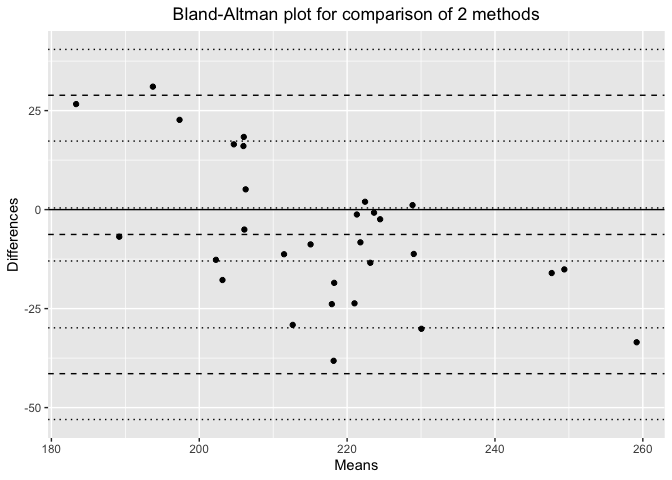<!-- -->

# References

Bates, D., Mächler, M., Bolker, B., & Walker, S. (2015). Fitting linear
mixed-effects models using lme4. *Journal of
Statistical Software*, *67*(1), 1–48.
<https://doi.org/10.18637/jss.v067.i01>

Portney, L. G., Watkins, M. P., et al. (2009). *Foundations of clinical
research: Applications to practice* (Vol. 892). Pearson/Prentice Hall
Upper Saddle River, NJ.

R Core Team. (2021). *R: A language and environment for statistical
computing*. Retrieved from <https://www.R-project.org/>

